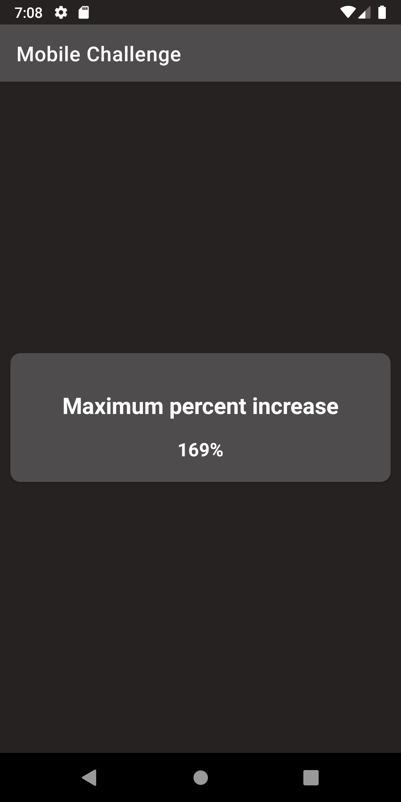

# Fretello Mobile Solution

Fretello's session mobile solution step 3.

### Prerequisites

The project has all required dependencies in the gradle files.
Add the Project to Android Studio or Intellij and build.all the required dependencies will be downloaded and installed.

## Architecture

The project uses MVVM architecture pattern.

## Libraries

* [ViewModel](https://developer.android.com/topic/libraries/architecture/viewmodel/)
* [DataBinding](https://developer.android.com/topic/libraries/data-binding)
* [Navigation Component](https://developer.android.com/guide/navigation/navigation-getting-started)
* [Retrofit](https://square.github.io/retrofit/)

## Screenshots
|

